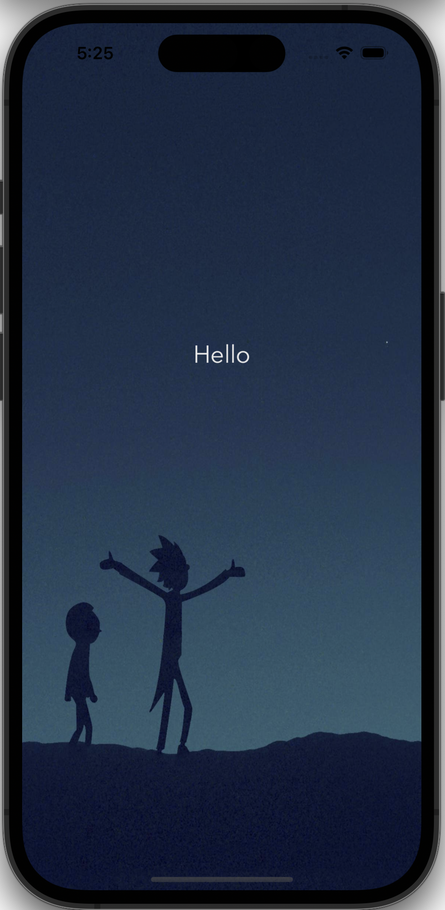
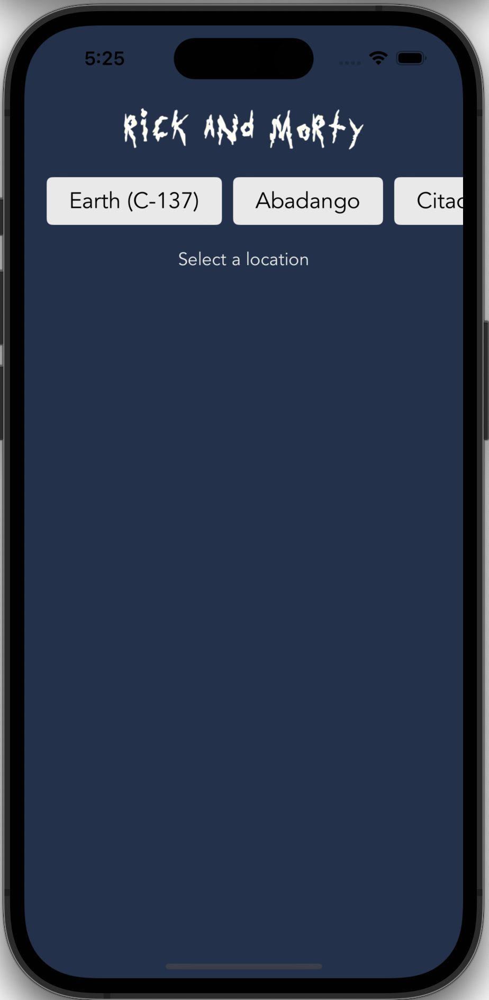
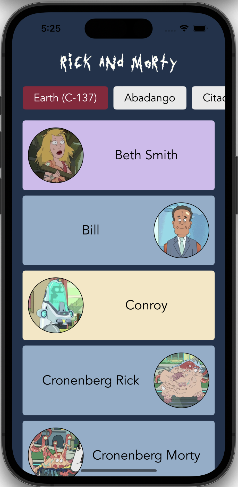
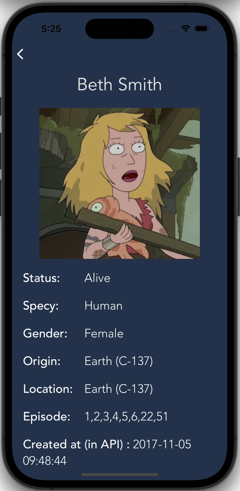
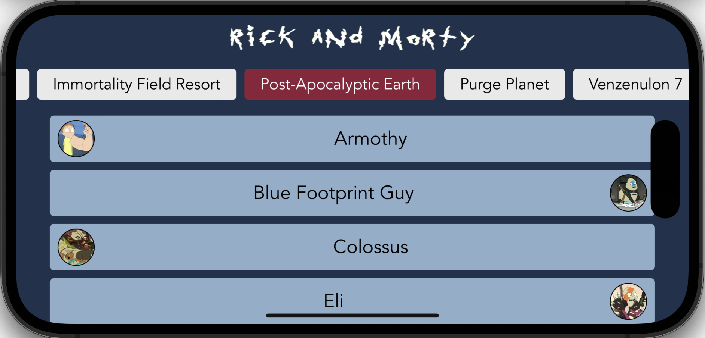
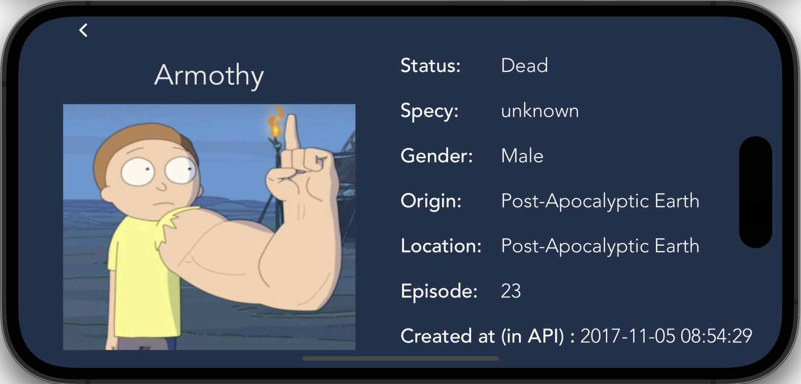

<h1 align="center"> Rick and Morty Wiki App </h1>  

 &nbsp;

<!-- START doctoc generated TOC please keep comment here to allow auto update -->
<!-- DON'T EDIT THIS SECTION, INSTEAD RE-RUN doctoc TO UPDATE -->

Table of Contents
- [Introduction](#introduction)
- [Screenshots](#screenshots)
- [System Requirements](#system-requirements)
- [Technologies](#technologies)
- [Dependencies](#dependencies)

<!-- END doctoc generated TOC please keep comment here to allow auto update -->

 

## Introduction

Rick and Morty Wiki App is an app which users can get knowledge about Rick and Morty TV series characters . 
User can filter characters according to locations and learn diifferent informations about them.
It is a pure native iOS app.

 

## Screenshots
 
 

## System Requirements

- iOS 16.2

## Technologies

- Swift
- UIKit
- Xcode

## Dependencies

- RickAndMortySwiftApi

